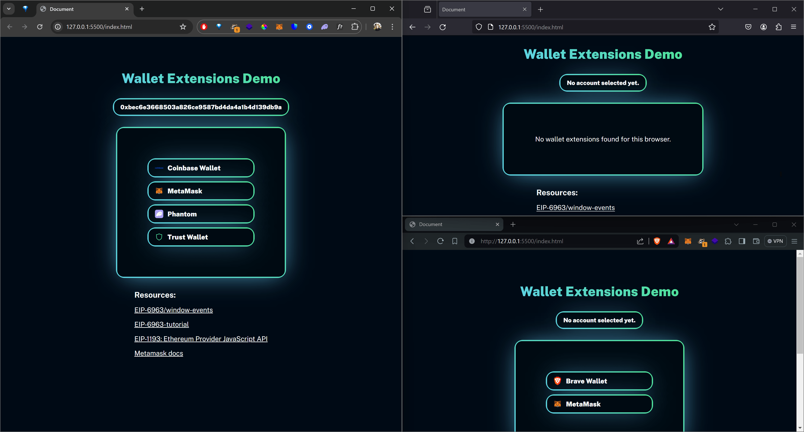

## Client Side Crypto Browser Wallet Connect Prototype

### TL;DR - What is this?

- I wanted a simple client side crypto wallet connect demo, without librairies. Just to understand how this browser wallet login thing works.
- Code quality is: Smashing things together until they work.

Demo: soon

### Resources
- <a href="https://eips.ethereum.org/EIPS/eip-6963#window-events">EIP-6963/window-events</a>
- <a href="https://github.com/nfwsncked/eip-6963-tutorial">EIP-6963-tutorial</a>
- <a href="https://eips.ethereum.org/EIPS/eip-1193">EIP-1193: Ethereum Provider JavaScript API</a>
- <a href="https://docs.metamask.io/wallet/reference/provider-api/#using-the-provider">Metamask docs</a>

### If you have a wallet extension installed, you will see a button to connect a wallet to the site.

1. Connect a wallet.
2. Get a div with the address.
3. Div has the custom attribute walletaddress="0xea....whatever"
4. Can be used to validate on blockchain, or whatever you want to do with it.

 

